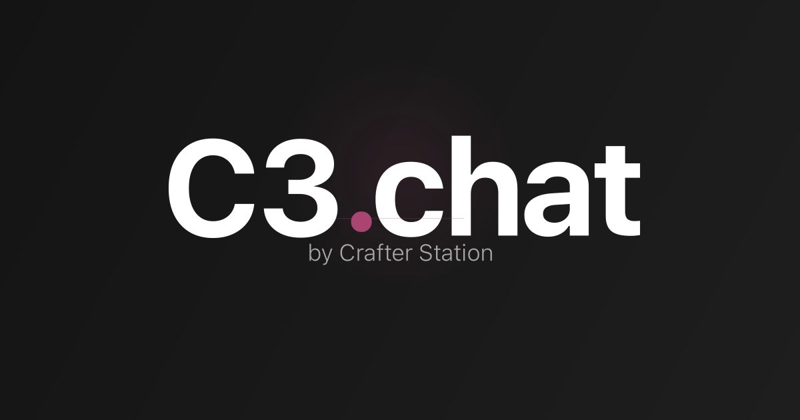

<h1 align="center">
  C3.chat
  <br />
</h1>

<p align="center">
  One chat, every AI model
  <br />
  <br />
  <a href="https://cs.chat">Website</a>
  ·
  <a href="https://github.com/crafter-station/cs.chat/issues">Issues</a>
</p>

<p align="center">
  <a href="https://nextjs.org">
    
  </a>
  <a href="https://react.dev">
    
  </a>
  <a href="https://sdk.vercel.ai">
    
  </a>
  <a href="https://www.typescriptlang.org">
    
  </a>
</p>

<p align="center">
  <sub>
    Built by
    <br />
    <a href="https://crafterstation.com">
       Crafter Station
    </a>
  </sub>
</p>

## About

C3.chat is an open-source AI chat interface that lets you talk to multiple AI models from a single place. Switch between GPT-4o, Claude, Gemini, DeepSeek, Grok, and more — all through one clean, fast UI.

## Features

**Multi-Model Support**: Chat with 13+ models from OpenAI, Anthropic, Google, Meta, DeepSeek, xAI, Perplexity, and Mistral — switch mid-conversation.<br/>
**Reasoning Display**: See the model's chain-of-thought when using reasoning models like DeepSeek R1.<br/>
**Citations & Sources**: Inline citations with source links for grounded responses.<br/>
**Streaming Responses**: Real-time token streaming with smooth scroll-to-bottom behavior.<br/>
**Thread Management**: Persistent conversation threads with auto-generated titles.<br/>
**Keyboard Shortcuts**: `Cmd+Shift+O` to start a new conversation instantly.<br/>
**Rate Limiting**: Built-in per-user rate limiting with Upstash Redis.<br/>
**Authentication**: Clerk-powered auth with anonymous guest access and usage tiers.<br/>

## Get Started

### Prerequisites

- [Bun](https://bun.sh) 1.1+
- A [Neon](https://neon.tech) Postgres database
- [Upstash](https://upstash.com) Redis instance
- [Clerk](https://clerk.com) application
- AI Gateway API key

### Installation

```bash
# Clone the repository
git clone https://github.com/crafter-station/cs.chat.git
cd cs.chat

# Install dependencies (Turborepo workspace, run from the repo root)
bun install

# Configure the web app's env vars
cp apps/web/.env.example apps/web/.env

# Push the database schema
bun run db:push

# Start both the web and mobile dev servers via Turbo
bun run dev
```

## Tech Stack

### Core

- Next.js 16
- React 19
- TypeScript
- Tailwind CSS 4

### AI & Backend

- Vercel AI SDK (`ai` + `@ai-sdk/react`)
- AI Gateway for multi-provider routing
- Drizzle ORM + Neon Postgres
- Upstash Redis (rate limiting)

### Auth & Analytics

- Clerk (authentication)
- Vercel Analytics

### UI

- shadcn/ui
- AI Elements (composable chat components)
- Radix UI primitives
- Motion (animations)

## Project Structure

Monorepo managed with [Turborepo](https://turborepo.com) and Bun workspaces.

```
cs.chat/
├── apps/
│   ├── web/             # Next.js web app
│   │   ├── app/         # Routes + streaming chat API
│   │   ├── components/  # UI, ai-elements, sidebar, chat
│   │   ├── hooks/       # use-threads, use-usage, chat controller
│   │   ├── lib/         # Rate limit, user service, thread actions
│   │   ├── db/          # Drizzle schema + client
│   │   └── public/      # Static assets & OG images
│   └── mobile/          # Expo (React Native) app
│       ├── app/         # expo-router entries
│       ├── components/  # chat-screen, sidebar, drawer, model-selector
│       ├── hooks/       # use-threads, use-usage
│       └── lib/         # API client, auth context, theme, query client
├── packages/
│   └── shared/          # Cross-app types, model list, defaults
├── turbo.json           # Pipeline + env passthrough
└── vercel.json          # Vercel config (see apps/web/vercel.json)
```

## Contributing

We welcome contributions! Open an [issue](https://github.com/crafter-station/cs.chat/issues) or submit a pull request.

## License

Licensed under the [GNU Affero General Public License v3.0 or later](./LICENSE) (AGPL-3.0-or-later).

**What this means in practice**:

- You can read, fork, modify, and self-host the code.
- If you run a modified version as a network service (SaaS), AGPL requires you to publish your modifications under AGPL too. You can't take this code, improve it in secret, and run a competing hosted product while keeping your changes closed.
- Personal use, educational use, evaluation, and private internal deployments are all fine.
- Redistribution must preserve the license and copyright notices.

If you need different terms for a specific commercial arrangement, reach out to [crafterstation.com](https://crafterstation.com).

---

<p align="center">
  Built with love by <a href="https://crafterstation.com">crafterstation.com</a>
</p>
